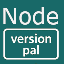

# Node Version Pal



A Visual Studio Code extension that displays the Node.js version from `.nvmrc` or `.node-version` files in the status bar and allows easy switching between versions using nvm or fnm.

[](https://github.com/GuidoZam/vscode-node-version-pal/actions/workflows/test.yml)

## Features

- 🔍 **Automatic Detection**: Automatically detects Node.js version from `.nvmrc` and `.node-version` files
- 📊 **Status Bar Display**: Shows the current Node version in the VS Code status bar
- 🔄 **Auto-refresh**: Automatically updates when version files change
- ⚡ **Multiple Workspace Support**: Supports multiple workspace folders
- 🎯 **Quick Switch**: Click the status bar to switch Node versions using nvm or fnm
- 📁 **Deep Scanning**: Recursively scans subdirectories for version files
- ➕ **Create Version Files**: Create `.nvmrc` or `.node-version` files when none exist
- 🛠️ **Smart Integration**: Automatically detects whether you have nvm or fnm installed

## How it works

The extension scans your workspace for `.nvmrc` and `.node-version` files and:

1. **File Detection**: Looks for `.nvmrc` or `.node-version` files in your workspace
2. **Version Parsing**: Extracts Node.js version from the file content
3. **Status Display**: Shows the version in the status bar with a Node.js icon
4. **Version Management**: Allows switching to the specified version using your installed version manager

### Supported Version Formats

- Semantic versions: `18.17.0`, `v20.5.1`
- Major versions: `18` (expands to `18.0.0`)
- Major.minor: `18.16` (expands to `18.16.0`)
- LTS versions: `lts`, `lts/hydrogen`, `lts/gallium`
- Keywords: `stable`, `latest`, `current`
- Pre-release: `19.0.0-alpha.1`, `18.0.0-rc.2`

## Usage

### Basic Usage

1. **Open a project** with a `.nvmrc` or `.node-version` file
2. **Check the status bar** - the Node version will appear automatically
3. **Click the status bar item** to switch to that Node version
4. **Use Command Palette** - Search for "Refresh Node Version" or "Switch Node Version"

### When No Version Files Exist

If your project doesn't have a `.nvmrc` or `.node-version` file:

1. **Status bar shows "Create"** - Click to create a version file
2. **Use Command Palette** - Search for "Create Version File"
3. **Choose file type** - Select `.nvmrc` or `.node-version`
4. **Enter Node version** - Specify the version (e.g., `18.17.0`, `lts`, `latest`)
5. **Select workspace** - Choose where to create the file (if multiple workspaces)

The extension validates your input and creates the file in the appropriate location.

### Creating Version Files

Create a `.nvmrc` file in your project root:
```
18.17.0
```

Or create a `.node-version` file:
```
20.5.1
```

### Version Manager Integration

The extension works with both **nvm** and **fnm**:

- **nvm**: Traditional Node Version Manager
- **fnm**: Fast Node Manager (Rust-based)

The extension automatically detects which one you have installed and uses it accordingly.

## Requirements

- Visual Studio Code 1.74.0 or higher
- Node.js 18.0.0 or higher
- At least one of the following Node version managers:
  - [nvm](https://github.com/nvm-sh/nvm) (macOS/Linux)
  - [fnm](https://github.com/Schniz/fnm) (Cross-platform, faster alternative)

## Extension Settings

This extension doesn't contribute any VS Code settings. It works out of the box!

## Commands

| Command | Description |
|---------|-------------|
| `Node Version Pal: Refresh Node Version` | Manually refresh the Node version detection |
| `Node Version Pal: Switch Node Version` | Switch to the Node version specified in version files |
| `Node Version Pal: Create Version File` | Create a new `.nvmrc` or `.node-version` file when none exists |

## Installation

1. Open VS Code
2. Go to Extensions (Ctrl+Shift+X / Cmd+Shift+X)
3. Search for "Node Version Pal"
4. Click Install

Or install from the [VS Code Marketplace](https://marketplace.visualstudio.com/).

## Supported Files

- `.nvmrc` - Traditional nvm version file
- `.node-version` - Alternative Node version file format

## Examples

### Example 1: Simple Version
```
# .nvmrc
18.17.0
```

### Example 2: LTS Version
```
# .nvmrc
lts/hydrogen
```

### Example 3: Major Version
```
# .node-version
20
```

## Troubleshooting

### No version shown in status bar
- Ensure you have a `.nvmrc` or `.node-version` file in your workspace
- Check that the version file contains a valid Node.js version
- Try refreshing with "Refresh Node Version" command

### Version manager not found
- Make sure you have either nvm or fnm installed
- For nvm users on macOS/Linux: ensure nvm is properly sourced in your shell
- For fnm users: ensure fnm is in your system PATH

### Version switching doesn't work
- Check that your version manager can access the specified Node version
- Try installing the version manually: `nvm install 18.17.0` or `fnm install 18.17.0`
- Ensure you have the necessary permissions to switch Node versions

## Known Issues

- The extension relies on `.nvmrc` or `.node-version` files to detect Node versions
- nvm integration on Windows is not supported (nvm doesn't run on Windows natively)
- Version switching requires a terminal - the extension opens a terminal to execute commands

## Contributing

Contributions are welcome! Please feel free to submit issues or pull requests.

1. Fork the repository
2. Create your feature branch
3. Commit your changes
4. Push to the branch
5. Create a Pull Request

## Changelog

See [CHANGELOG.md](CHANGELOG.md) for details.

## License

This project is licensed under the MIT License - see the [LICENSE](LICENSE) file for details.

## Related Projects

- [nvm](https://github.com/nvm-sh/nvm) - Node Version Manager
- [fnm](https://github.com/Schniz/fnm) - Fast Node Manager
- [SPFx Version Pal](https://marketplace.visualstudio.com/items?itemName=guidozam.vscode-spfx-version-pal) - Similar extension for SharePoint Framework

---

Made with ❤️ for the Node.js community